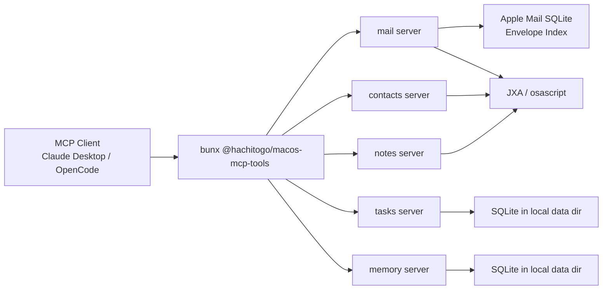

# @hachitogo/macos-mcp-tools

MCP servers for macOS: Apple Mail, Contacts, Notes, Tasks, and Memory.

The project uses a hybrid approach: JXA/`osascript` for macOS app automation, and direct read-only SQLite access where it is faster and more reliable. In practice this matters most for Apple Mail reads, where pure `osascript` approaches tended to time out on non-trivial queries.

## What It Provides

- `mail`: read/search Apple Mail and perform selected message actions
- `contacts`: read and update Apple Contacts via JXA
- `notes`: read and update Apple Notes via JXA
- `tasks`: local SQLite-backed task manager
- `memory`: local SQLite-backed structured memory store

## Architecture



## Requirements

- macOS
- [Bun](https://bun.sh) 1.0+
- Optional: `pdftotext` for PDF attachment text extraction

Install Bun with Homebrew:

```bash
brew install oven-sh/bun/bun
```

Optional dependency for PDF extraction:

```bash
brew install poppler
```

## Quick Start

### 1. Verify the CLI locally

```bash
bunx @hachitogo/macos-mcp-tools mail
```

Each subcommand starts one standalone MCP server on stdio:

```bash
bunx @hachitogo/macos-mcp-tools mail
bunx @hachitogo/macos-mcp-tools contacts
bunx @hachitogo/macos-mcp-tools notes
bunx @hachitogo/macos-mcp-tools tasks
bunx @hachitogo/macos-mcp-tools memory
```

### 2. Configure Claude Desktop

Add entries like this to your Claude Desktop MCP config:

```json
{
  "mcpServers": {
    "apple_mail": {
      "command": "bunx",
      "args": ["@hachitogo/macos-mcp-tools", "mail"]
    },
    "apple_contacts": {
      "command": "bunx",
      "args": ["@hachitogo/macos-mcp-tools", "contacts"]
    },
    "apple_notes": {
      "command": "bunx",
      "args": ["@hachitogo/macos-mcp-tools", "notes"]
    },
    "tasks": {
      "command": "bunx",
      "args": ["@hachitogo/macos-mcp-tools", "tasks"]
    },
    "memory": {
      "command": "bunx",
      "args": ["@hachitogo/macos-mcp-tools", "memory"]
    }
  }
}
```

### 3. Configure OpenCode

Add entries like this to your OpenCode MCP config:

```json
{
  "mcp": {
    "apple_mail": {
      "type": "local",
      "command": ["bunx", "@hachitogo/macos-mcp-tools", "mail"]
    },
    "apple_contacts": {
      "type": "local",
      "command": ["bunx", "@hachitogo/macos-mcp-tools", "contacts"]
    },
    "apple_notes": {
      "type": "local",
      "command": ["bunx", "@hachitogo/macos-mcp-tools", "notes"]
    },
    "tasks": {
      "type": "local",
      "command": ["bunx", "@hachitogo/macos-mcp-tools", "tasks"]
    },
    "memory": {
      "type": "local",
      "command": ["bunx", "@hachitogo/macos-mcp-tools", "memory"]
    }
  }
}
```

## Servers

### Mail

Uses a hybrid implementation: direct read-only SQLite queries for fast message reads and searches, plus JXA for actions like fetching bodies, listing attachments, and mutating message state.

Tools: `unread_emails`, `mark_emails_read`, `fetch_email_body`, `mark_emails_junk`, `mark_emails_not_junk`, `list_email_attachments`, `fetch_email_attachment`, `search_emails`

### Contacts

CRUD for Apple Contacts people and groups via JXA.

Tools: `contacts_people`, `contacts_groups`

### Notes

Full CRUD for Apple Notes folders and notes, plus search, via JXA.

Tools: `list_folders`, `create_folder`, `list_notes`, `get_note`, `create_note`, `update_note`, `move_note`, `append_to_note`, `delete_note`, `delete_folder`, `search_notes`

### Tasks

SQLite-backed task manager with projects, tags, repeat rules, and flagging.

Tools: `list_tasks`, `get_task`, `create_task`, `update_task`, `complete_task`, `drop_task`, `reopen_task`, `list_projects`

### Memory

Structured memory store with subject-action-object triples, aliases, and duration queries.

Tools: `create_entry`, `update_entry`, `get_entry`, `search_entries`, `query_last_occurrence`, `query_duration_since`

## Configuration

### Data Directory

`tasks` and `memory` store SQLite databases in this order:

1. `MACOS_TOOLS_DATA_DIR`
2. existing `.opencode/data` in the current working directory
3. `~/.local/share/macos-tools/`

Example:

```bash
MACOS_TOOLS_DATA_DIR=/path/to/data bunx @hachitogo/macos-mcp-tools tasks
```

### Mail Account Classification

The mail server may create `config/email.json` locally to classify accounts. This file is treated as generated local state and is ignored by git.

## Testing

- Unit tests: `bun test`
- Type checks: `bun run typecheck`
- Opt-in integration tests: `bun run test:integration`
- Opt-in live macOS app smoke tests: `bun run test:integration:apps`

Integration tests are isolated and non-destructive. The default opt-in suite uses temporary data directories so it does not touch real task or memory databases. The live macOS app smoke tests are also read-only, but they do connect to your local Mail, Contacts, and Notes data and therefore remain separately opt-in.

## License

MIT
