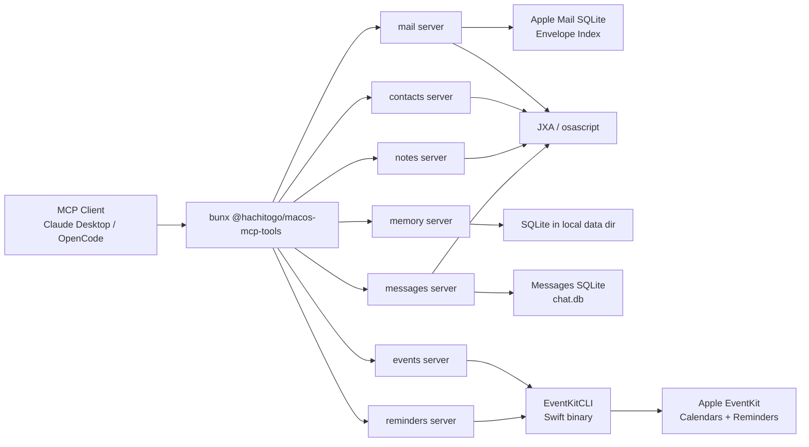

# @hachitogo/macos-mcp-tools

MCP servers for macOS: Apple Mail, Contacts, Notes, Memory, Messages, Calendar Events, and Reminders.

The project uses a hybrid approach: JXA/`osascript` for macOS app automation, and direct read-only SQLite access where it is faster and more reliable. In practice this matters most for Apple Mail reads, where pure `osascript` approaches tended to time out on non-trivial queries. Calendar Events and Reminders use a compiled Swift binary (EventKitCLI) that interfaces directly with Apple's EventKit framework.

## What It Provides

- `mail`: read/search Apple Mail and perform selected message actions
- `contacts`: read and update Apple Contacts via JXA
- `notes`: read and update Apple Notes via JXA
- `memory`: local SQLite-backed structured memory store
- `messages`: read/search/send Apple Messages (iMessage and SMS)
- `events`: read, create, update, and delete Apple Calendar events via EventKit
- `reminders`: read, create, update, and delete Apple Reminders with lists, subtasks, tags, recurrence, and location triggers via EventKit

## Architecture


```mermaid
flowchart LR
  Client["MCP Client\nClaude Desktop / OpenCode"] --> CLI["bunx @hachitogo/macos-mcp-tools <subcommand>"]
  CLI --> Mail["mail server"]
  CLI --> Contacts["contacts server"]
  CLI --> Notes["notes server"]
  CLI --> Memory["memory server"]
  CLI --> Messages["messages server"]
  CLI --> Events["events server"]
  CLI --> Reminders["reminders server"]

  Mail --> MailDB["Apple Mail SQLite\nEnvelope Index"]
  Mail --> JXA["JXA / osascript"]
  Contacts --> JXA
  Notes --> JXA
  Memory --> MemoryDB["SQLite in local data dir"]
  Messages --> MsgDB["Messages SQLite\nchat.db"]
  Messages --> JXA
  Events --> EventKitCLI["EventKitCLI\nSwift binary"]
  Reminders --> EventKitCLI
  EventKitCLI --> EventKit["Apple EventKit\nCalendars + Reminders"]
```

## Requirements

- macOS
- [Bun](https://bun.sh) 1.0+
- Optional: `pdftotext` for PDF attachment text extraction
- Full Disk Access for the host process (required by the mail server to read `~/Library/Mail/V10/MailData/Envelope Index` and by the messages server to read `~/Library/Messages/chat.db`)
- Automation permission for Mail, Contacts, Notes and Messages; macOS prompts on first use of each
- Xcode Command Line Tools, only to rebuild the EventKitCLI Swift binary with `bun run build:swift`. The prebuilt `bin/EventKitCLI` is Apple Silicon (arm64) only; Intel Macs must rebuild it.

Install Bun with Homebrew:

```bash
brew install oven-sh/bun/bun
```

Optional dependency for PDF extraction:

```bash
brew install poppler
```

## Quick Start

### 1. Verify the CLI locally

```bash
bunx @hachitogo/macos-mcp-tools mail
```

Each subcommand starts one standalone MCP server on stdio:

```bash
bunx @hachitogo/macos-mcp-tools mail
bunx @hachitogo/macos-mcp-tools contacts
bunx @hachitogo/macos-mcp-tools notes
bunx @hachitogo/macos-mcp-tools memory
bunx @hachitogo/macos-mcp-tools messages
bunx @hachitogo/macos-mcp-tools events
bunx @hachitogo/macos-mcp-tools reminders
```

### 2. Configure Claude Desktop

Add entries like this to your Claude Desktop MCP config:

```json
{
  "mcpServers": {
    "apple_mail": {
      "command": "bunx",
      "args": ["@hachitogo/macos-mcp-tools", "mail"]
    },
    "apple_contacts": {
      "command": "bunx",
      "args": ["@hachitogo/macos-mcp-tools", "contacts"]
    },
    "apple_notes": {
      "command": "bunx",
      "args": ["@hachitogo/macos-mcp-tools", "notes"]
    },
    "memory": {
      "command": "bunx",
      "args": ["@hachitogo/macos-mcp-tools", "memory"]
    },
    "apple_messages": {
      "command": "bunx",
      "args": ["@hachitogo/macos-mcp-tools", "messages"]
    },
    "apple_events": {
      "command": "bunx",
      "args": ["@hachitogo/macos-mcp-tools", "events"]
    },
    "apple_reminders": {
      "command": "bunx",
      "args": ["@hachitogo/macos-mcp-tools", "reminders"]
    }
  }
}
```

### 3. Configure OpenCode

Add entries like this to your OpenCode MCP config:

```json
{
  "mcp": {
    "apple_mail": {
      "type": "local",
      "command": ["bunx", "@hachitogo/macos-mcp-tools", "mail"]
    },
    "apple_contacts": {
      "type": "local",
      "command": ["bunx", "@hachitogo/macos-mcp-tools", "contacts"]
    },
    "apple_notes": {
      "type": "local",
      "command": ["bunx", "@hachitogo/macos-mcp-tools", "notes"]
    },
    "memory": {
      "type": "local",
      "command": ["bunx", "@hachitogo/macos-mcp-tools", "memory"]
    },
    "apple_messages": {
      "type": "local",
      "command": ["bunx", "@hachitogo/macos-mcp-tools", "messages"]
    },
    "apple_events": {
      "type": "local",
      "command": ["bunx", "@hachitogo/macos-mcp-tools", "events"]
    },
    "apple_reminders": {
      "type": "local",
      "command": ["bunx", "@hachitogo/macos-mcp-tools", "reminders"]
    }
  }
}
```

## Servers

### Mail

Uses a hybrid implementation: direct read-only SQLite queries for fast message reads and searches, plus JXA for actions like fetching bodies, listing attachments, and mutating message state.

Tools: `unread_emails`, `mark_emails_read`, `fetch_email_body`, `mark_emails_junk`, `mark_emails_not_junk`, `flag_emails`, `list_email_attachments`, `fetch_email_attachment`, `search_emails`, `extract_email_links`, `send_email`, `reply_email`, `forward_email`

### Contacts

CRUD for Apple Contacts people and groups via JXA.

Tools: `contacts_people`, `contacts_groups`

### Notes

Full CRUD for Apple Notes folders and notes, plus search, via JXA.

Tools: `list_folders`, `create_folder`, `list_notes`, `get_note`, `create_note`, `update_note`, `move_note`, `append_to_note`, `delete_note`, `delete_folder`, `search_notes`

### Memory

Structured memory store with subject-action-object triples, aliases, and duration queries.

Tools: `create_entry`, `update_entry`, `get_entry`, `search_entries`, `query_last_occurrence`, `query_duration_since`

### Messages

Hybrid implementation: direct read-only SQLite queries against `~/Library/Messages/chat.db` for reading and searching, plus JXA for sending messages. Supports both 1:1 and group chat sending. Inspired by [@griches/apple-messages-mcp](https://github.com/griches/apple-mcp) (MIT).

Tools: `list_chats`, `get_messages`, `search_messages`, `get_participants`, `send_message`

### Events

Manages Apple Calendar events via a compiled Swift binary using EventKit. Supports full CRUD with structured locations, alarms, recurrence rules, and availability status.

Tools: `calendar_events`, `calendar_calendars`

### Reminders

Manages Apple Reminders via EventKit. Supports full CRUD with subtasks (stored as checklists in notes), tags (native #tag format), priority levels, location triggers, alarms, and recurrence rules.

Tools: `reminders_tasks`, `reminders_lists`, `reminders_subtasks`

## Configuration

### Data Directory

`memory` stores its SQLite database at:

1. `MACOS_TOOLS_DATA_DIR` if set
2. `~/.local/share/macos-tools/` otherwise

Example:

```bash
MACOS_TOOLS_DATA_DIR=/path/to/data bunx @hachitogo/macos-mcp-tools memory
```

### Mail Account Classification

The mail server may create `config/email.json` locally to classify accounts. This file is treated as generated local state and is ignored by git.

## Testing

- Lint and format check: `bun run lint` (fix with `bun run format`)
- Unit tests: `bun test`
- Type checks: `bun run typecheck`
- Opt-in integration tests: `bun run test:integration`
- Opt-in live macOS app smoke tests: `bun run test:integration:apps`

- Swift binary rebuild: `bun run build:swift` (requires Xcode Command Line Tools)

Integration tests are isolated and non-destructive. The default opt-in suite uses temporary data directories so it does not touch real memory databases. The live macOS app smoke tests are also read-only, but they do connect to your local Mail, Contacts, and Notes data and therefore remain separately opt-in.

## License

MIT
