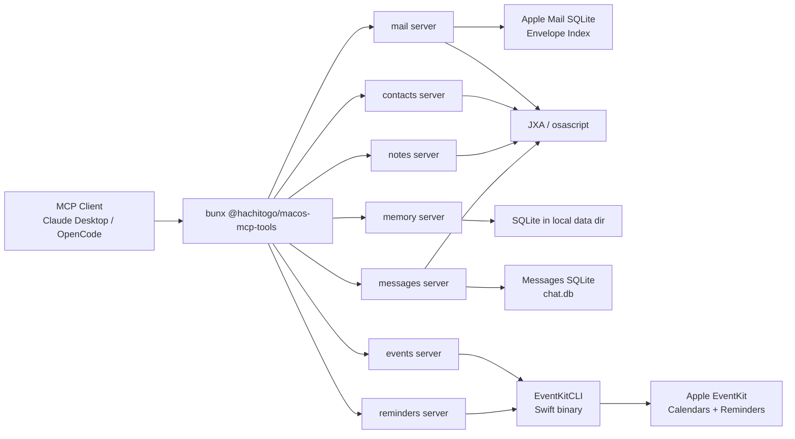

# @hachitogo/macos-mcp-tools

MCP servers for macOS: Apple Mail, Contacts, Notes, Memory, Messages, Calendar Events, and Reminders.

The project uses a hybrid approach: JXA/`osascript` for macOS app automation, and direct read-only SQLite access where it is faster and more reliable. In practice this matters most for Apple Mail reads, where pure `osascript` approaches tended to time out on non-trivial queries. Calendar Events and Reminders use a compiled Swift binary (EventKitCLI) that interfaces directly with Apple's EventKit framework.

## What It Provides

- `mail`: read/search Apple Mail and perform selected message actions
- `contacts`: read and update Apple Contacts via JXA
- `notes`: read and update Apple Notes via JXA
- `memory`: local SQLite-backed structured memory store
- `messages`: read/search/send Apple Messages (iMessage and SMS)
- `events`: read, create, update, and delete Apple Calendar events via EventKit
- `reminders`: read, create, update, and delete Apple Reminders with lists, subtasks, tags, recurrence, and location triggers via EventKit

## Architecture


```mermaid
flowchart LR
  Client["MCP Client\nClaude Desktop / OpenCode"] --> CLI["bunx @hachitogo/macos-mcp-tools <subcommand>"]
  CLI --> Mail["mail server"]
  CLI --> Contacts["contacts server"]
  CLI --> Notes["notes server"]
  CLI --> Memory["memory server"]
  CLI --> Messages["messages server"]
  CLI --> Events["events server"]
  CLI --> Reminders["reminders server"]

  Mail --> MailDB["Apple Mail SQLite\nEnvelope Index"]
  Mail --> JXA["JXA / osascript"]
  Contacts --> JXA
  Notes --> JXA
  Memory --> MemoryDB["SQLite in local data dir"]
  Messages --> MsgDB["Messages SQLite\nchat.db"]
  Messages --> JXA
  Events --> EventKitCLI["EventKitCLI\nSwift binary"]
  Reminders --> EventKitCLI
  EventKitCLI --> EventKit["Apple EventKit\nCalendars + Reminders"]
```

## Requirements

- macOS
- [Bun](https://bun.sh) 1.0+
- Optional: `pdftotext` for PDF attachment text extraction
- Full Disk Access for the host process (required by the mail server to read `~/Library/Mail/V10/MailData/Envelope Index` and by the messages server to read `~/Library/Messages/chat.db`)
- Automation permission for Mail, Contacts, Notes and Messages; macOS prompts on first use of each
- Xcode Command Line Tools, only to rebuild the EventKitCLI Swift binary with `bun run build:swift`. The prebuilt `bin/EventKitCLI` is Apple Silicon (arm64) only; Intel Macs must rebuild it.

Install Bun with Homebrew:

```bash
brew install oven-sh/bun/bun
```

Optional dependency for PDF extraction:

```bash
brew install poppler
```

## Quick Start

### 1. Install globally (the only supported pattern for MCP hosts)

```bash
bun install -g @hachitogo/macos-mcp-tools@latest
```

Then find the absolute path of the installed launcher. You will paste this path into every MCP host config:

```bash
echo "$(bun pm bin -g)/macos-mcp-tools"
```

Typical results are `/Users/<you>/.bun/bin/macos-mcp-tools` when `BUN_INSTALL` is set, or `/Users/<you>/.cache/.bun/bin/macos-mcp-tools` when it is not. Verify it runs:

```bash
"$(bun pm bin -g)/macos-mcp-tools" --help
```

> **Do not use `bunx` in an MCP host config.** Hosts such as Claude Desktop start all seven servers at the same instant. `bunx` links each launch into one shared temp directory with no lock, so seven concurrent `bunx` runs corrupt each other's `node_modules` and the servers crash on startup with errors like `Cannot find package 'zod-to-json-schema'`, `Failed to link which: EEXIST`, or `could not determine executable to run`. Warming the cache does not prevent it. A global install has no install step at launch, so the race cannot happen.

> **Use the absolute path, not a bare command name.** GUI hosts do not inherit your shell `PATH`, so `macos-mcp-tools` or `bun` alone will often fail with "No executable file" even though they work in Terminal.

### 2. Configure Claude Desktop

Open Settings → Developer → Edit Config (or edit `~/Library/Application Support/Claude/claude_desktop_config.json` while Claude Desktop is fully quit; the app can overwrite edits made while it is running). Replace `/Users/<you>/.cache/.bun/bin/macos-mcp-tools` with the path from step 1:

```json
{
  "mcpServers": {
    "apple_mail":      { "command": "/Users/<you>/.cache/.bun/bin/macos-mcp-tools", "args": ["mail"] },
    "apple_contacts":  { "command": "/Users/<you>/.cache/.bun/bin/macos-mcp-tools", "args": ["contacts"] },
    "apple_notes":     { "command": "/Users/<you>/.cache/.bun/bin/macos-mcp-tools", "args": ["notes"] },
    "memory":          { "command": "/Users/<you>/.cache/.bun/bin/macos-mcp-tools", "args": ["memory"] },
    "apple_messages":  { "command": "/Users/<you>/.cache/.bun/bin/macos-mcp-tools", "args": ["messages"] },
    "apple_events":    { "command": "/Users/<you>/.cache/.bun/bin/macos-mcp-tools", "args": ["events"] },
    "apple_reminders": { "command": "/Users/<you>/.cache/.bun/bin/macos-mcp-tools", "args": ["reminders"] }
  }
}
```

Quit and reopen Claude Desktop. If a server fails to start, read `~/Library/Logs/Claude/mcp-server-<name>.log`; it prints the exact command Desktop ran and anything the server wrote to stderr.

### 3. Configure Claude Code

One command per server, same launcher path:

```bash
for s in mail contacts notes memory messages events reminders; do claude mcp add "apple_$s" -- "$(bun pm bin -g)/macos-mcp-tools" "$s"; done
```

(The `memory` server ends up named `apple_memory` with this loop; rename it if you prefer.)

### 4. Configure OpenCode

```json
{
  "mcp": {
    "apple_mail":      { "type": "local", "command": ["/Users/<you>/.cache/.bun/bin/macos-mcp-tools", "mail"] },
    "apple_contacts":  { "type": "local", "command": ["/Users/<you>/.cache/.bun/bin/macos-mcp-tools", "contacts"] },
    "apple_notes":     { "type": "local", "command": ["/Users/<you>/.cache/.bun/bin/macos-mcp-tools", "notes"] },
    "memory":          { "type": "local", "command": ["/Users/<you>/.cache/.bun/bin/macos-mcp-tools", "memory"] },
    "apple_messages":  { "type": "local", "command": ["/Users/<you>/.cache/.bun/bin/macos-mcp-tools", "messages"] },
    "apple_events":    { "type": "local", "command": ["/Users/<you>/.cache/.bun/bin/macos-mcp-tools", "events"] },
    "apple_reminders": { "type": "local", "command": ["/Users/<you>/.cache/.bun/bin/macos-mcp-tools", "reminders"] }
  }
}
```

### 5. Updating

A global install does not update itself. After a new release:

```bash
bun install -g @hachitogo/macos-mcp-tools@latest
```

Then quit and reopen the host. Check what is installed versus published with:

```bash
"$(bun pm bin -g)/macos-mcp-tools" --help | head -1; bun pm view @hachitogo/macos-mcp-tools dist-tags
```

## Servers

### Mail

Uses a hybrid implementation: direct read-only SQLite queries for fast message reads and searches, plus JXA for actions like fetching bodies, listing attachments, and mutating message state.

Tools: `unread_emails`, `mark_emails_read`, `fetch_email_body`, `mark_emails_junk`, `mark_emails_not_junk`, `flag_emails`, `list_email_attachments`, `fetch_email_attachment`, `search_emails`, `extract_email_links`, `send_email`, `reply_email`, `forward_email`

### Contacts

CRUD for Apple Contacts people and groups via JXA.

Tools: `contacts_people`, `contacts_groups`

### Notes

Full CRUD for Apple Notes folders and notes, plus search, via JXA.

Tools: `list_folders`, `create_folder`, `list_notes`, `get_note`, `create_note`, `update_note`, `move_note`, `append_to_note`, `delete_note`, `delete_folder`, `search_notes`

### Memory

Structured memory store with subject-action-object triples, aliases, and duration queries.

Tools: `create_entry`, `update_entry`, `get_entry`, `search_entries`, `query_last_occurrence`, `query_duration_since`

### Messages

Hybrid implementation: direct read-only SQLite queries against `~/Library/Messages/chat.db` for reading and searching, plus JXA for sending messages. Supports both 1:1 and group chat sending. Inspired by [@griches/apple-messages-mcp](https://github.com/griches/apple-mcp) (MIT).

Tools: `list_chats`, `get_messages`, `search_messages`, `get_participants`, `send_message`

### Events

Manages Apple Calendar events via a compiled Swift binary using EventKit. Supports full CRUD with structured locations, alarms, recurrence rules, and availability status.

Tools: `calendar_events`, `calendar_calendars`

### Reminders

Manages Apple Reminders via EventKit. Supports full CRUD with subtasks (stored as checklists in notes), tags (native #tag format), priority levels, location triggers, alarms, and recurrence rules.

Tools: `reminders_tasks`, `reminders_lists`, `reminders_subtasks`

## Examples

Everything below is typed into Claude Desktop as a normal chat message. Claude picks the tool, calls it, and answers from the result. Names, addresses and IDs are invented.

### "Give me a summary of all unread emails"

Claude calls `unread_emails` on the `apple_mail` server with `{ "limit": 25 }`. The tool returns grouped text (plus the same data as `structuredContent`):

```text
Found 4 unread emails.

Northwind (work) — 3 unread
1. [2026-09-18T08:42:00] Priya Raman — Q3 pipeline review: agenda (INBOX)
2. [2026-09-18T07:15:00] GitHub — [northwind/api] PR #412 ready for review (INBOX)
3. [2026-09-17T18:03:00] Sam Okafor — Re: contractor invoice (INBOX)

Personal (personal) — 1 unread
4. [2026-09-18T06:58:00] Bainbridge Library — Hold ready for pickup (INBOX)
```

Claude's reply, roughly:

> You have 4 unread. **Work (3):** Priya sent the agenda for today's Q3 pipeline review; GitHub says PR #412 on northwind/api is ready for review; Sam followed up on the contractor invoice thread. **Personal (1):** the library has a hold ready for pickup. Want me to open any of these?

Follow-ups that work: *"Read me Sam's email"* (`fetch_email_body`), *"Mark the GitHub one as read"* (`mark_emails_read`), *"Any links in the library email?"* (`extract_email_links`).

### "What reminders are due or overdue as of today, ranked by priority?"

Claude calls `reminders_tasks` on `apple_reminders` twice, `{ "action": "read", "dueWithin": "overdue" }` and `{ "action": "read", "dueWithin": "today" }`, then sorts. Each call returns markdown:

```text
### Reminders (Total: 3)

- [ ] Renew car registration
  - List: Errands
  - ID: 7E1C2A4F-...
  - Priority: high (1)
  - Due: 2026-09-15
- [ ] Reply to school volunteer form
  - List: Family
  - ID: 0B93D6E2-...
  - Priority: medium (5)
  - Due: 2026-09-17
- [ ] Order printer toner
  - List: Errands
  - ID: C41F8B7D-...
  - Due: 2026-09-16
```

Claude's reply, roughly:

> **Overdue, highest priority first:** 1) Renew car registration (high, due Sep 15, 3 days late). 2) Reply to school volunteer form (medium, due Sep 17). 3) Order printer toner (no priority, due Sep 16). **Due today:** Submit expense report (high), Call the vet (medium). Want me to mark any complete or push the toner one to Friday?

Follow-ups: *"Mark the toner one done"* (`reminders_tasks` with `action: "update"`, `id`, `completed: true`), *"Add 'pick up dry cleaning' to Errands for tomorrow, high priority"* (`action: "create"`).

### "What's on my calendar tomorrow?"

Claude calls `calendar_events` on `apple_events` with `{ "action": "read", "startDate": "2026-09-19 00:00:00", "endDate": "2026-09-20 00:00:00" }`:

```text
### Calendar Events (Total: 2)

- Dentist
  - Calendar: Family
  - ID: 27985AF3-...:5C0E2D91-...
  - Start: 2026-09-19T09:30:00-07:00
  - End: 2026-09-19T10:30:00-07:00
  - Location: 1200 Winslow Way E
- Team sync
  - Calendar: Work
  - ID: 5D22C354-...:a8f2k1@google.com
  - Start: 2026-09-19T13:00:00-07:00
  - End: 2026-09-19T13:30:00-07:00
  - Availability: busy
```

> Two things tomorrow: dentist at 9:30 on Winslow Way (an hour), and the 1:00 team sync for 30 minutes. The rest of the day is open.

If you leave the dates out, the read defaults to the next 14 days.

### "Did anyone text me about Saturday's ride?"

Claude calls `search_messages` on `apple_messages` with `{ "query": "Saturday", "limit": 20 }`:

```text
Found 2 message(s) matching "Saturday":

[9/17/2026, 8:12:44 PM] [+14155550123] +14155550123: Still on for Saturday? Thinking 7am from the ferry.
[9/17/2026, 8:20:10 PM] [+14155550123] me: 7 works. Bring lights, it'll be dark.
```

> Yes. Dana asked last night if Saturday is still on and suggested 7am from the ferry; you replied that 7 works and to bring lights. Want me to add it to the Family calendar?

Follow-up: *"Yes, 7 to 10, call it Group ride"* (`calendar_events` with `action: "create"`).

### "Save a note with the three action items from today's review"

Claude calls `create_note` on `apple_notes` with `{ "folder": "Work", "title": "Q3 pipeline review — actions", "body": "<ul><li>Priya: send updated forecast by Fri</li><li>Me: review PR #412</li><li>Sam: resend invoice with PO number</li></ul>" }`:

```json
{
  "success": true,
  "name": "Q3 pipeline review — actions",
  "folder": "Work"
}
```

> Saved to Notes under Work as "Q3 pipeline review — actions" with the three items.

### "When did I last get the car serviced, and how long ago was that?"

The `memory` server is a small structured store for facts you want Claude to keep across conversations. Claude calls `query_duration_since` with `{ "subject": "car", "action": "serviced" }`:

```json
{
  "source": "memory",
  "query": { "subject": "car", "action": "serviced" },
  "status": "matched",
  "entry": {
    "id": "b2c4e6f8-…",
    "kind": "event",
    "subject": "car",
    "action": "serviced",
    "happened_at": "2026-03-02"
  },
  "elapsed_days": 200
}
```

> Last service was March 2, about 200 days ago (6.5 months). If you're on a six-month interval, you're due.

To record one: *"Remember that I serviced the car today"* (`create_entry`).

## Configuration

### Data Directory

`memory` stores its SQLite database at:

1. `MACOS_TOOLS_DATA_DIR` if set
2. `~/.local/share/macos-tools/` otherwise

Example:

```bash
MACOS_TOOLS_DATA_DIR=/path/to/data bunx @hachitogo/macos-mcp-tools memory
```

### Mail Account Classification

The mail server may create `config/email.json` locally to classify accounts. This file is treated as generated local state and is ignored by git.

## Testing

- Lint and format check: `bun run lint` (fix with `bun run format`)
- Unit tests: `bun test`
- Type checks: `bun run typecheck`
- Opt-in integration tests: `bun run test:integration`
- Opt-in live macOS app smoke tests: `bun run test:integration:apps`

- Swift binary rebuild: `bun run build:swift` (requires Xcode Command Line Tools)

Integration tests are isolated and non-destructive. The default opt-in suite uses temporary data directories so it does not touch real memory databases. The live macOS app smoke tests are also read-only, but they do connect to your local Mail, Contacts, and Notes data and therefore remain separately opt-in.

## License

MIT
